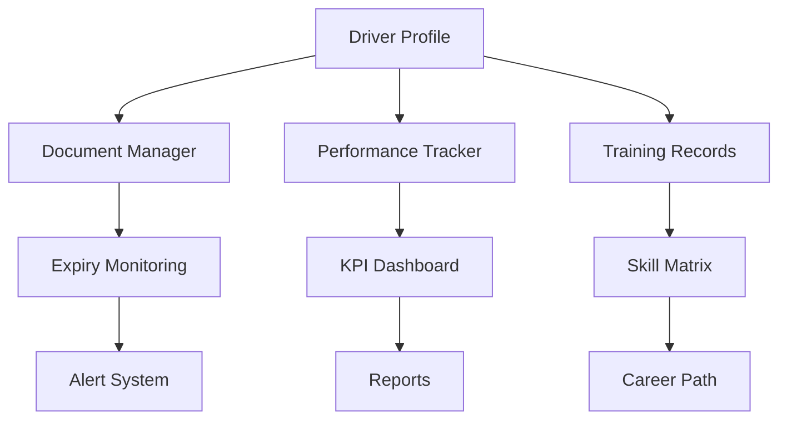

# DriveJobs.gr - Implementation Roadmap & Technical Specifications

## 🎯 Στόχος Εγγράφου
Αυτό το έγγραφο παρέχει λεπτομερείς τεχνικές προδιαγραφές και οδηγίες υλοποίησης για τη μετάβαση της DriveJobs.gr από την τρέχουσα κατάσταση στο όραμα του ολοκληρωμένου οικοσυστήματος.

## 📊 Executive Dashboard - Current vs Target State

| Πυλώνας | Τρέχουσα Κατάσταση | Στόχος 6 Μηνών | Στόχος 12 Μηνών | Στόχος 24 Μηνών |
|---------|-------------------|----------------|-----------------|-----------------|
| **1. Matching Platform** | 20% | 80% | 95% | 100% |
| **2. Academy** | 5% | 40% | 80% | 100% |
| **3. Driver Management** | 15% | 50% | 85% | 100% |
| **4. Fleet Management** | 0% | 20% | 60% | 100% |
| **5. Legal Hub** | 0% | 10% | 40% | 80% |

## 🚀 Phase 1: Core Platform Enhancement (Μήνες 1-3)

### 1.1 AI-Powered Matching System

#### Technical Implementation
```python
# Προτεινόμενη Αρχιτεκτονική ML Pipeline

1. Data Collection Layer
   - Driver profiles (skills, experience, certifications)
   - Job requirements (skills needed, location, salary)
   - Historical matching data
   - Performance metrics

2. Feature Engineering
   - Skill embeddings using Word2Vec
   - Location-based features (distance, route compatibility)
   - Experience scoring algorithm
   - Availability matching

3. Model Architecture
   - Primary: Neural Collaborative Filtering
   - Secondary: XGBoost for ranking
   - Ensemble method for final scoring

4. Real-time Inference
   - Redis for caching predictions
   - API Gateway for model serving
   - A/B testing framework
```

#### Implementation Steps
1. **Week 1-2**: Data pipeline setup
   - ETL processes για existing data
   - Feature store implementation
   - Data quality monitoring

2. **Week 3-4**: Model development
   - Baseline model (simple matching)
   - Advanced model training
   - Evaluation metrics setup

3. **Week 5-6**: Integration
   - API development
   - Frontend integration
   - Performance optimization

### 1.2 Payment & Subscription System

#### Architecture Design
```yaml
Payment Infrastructure:
  Gateway: Stripe
  
  Components:
    - Subscription Manager
      - Plan definitions
      - Billing cycles
      - Feature access control
    
    - Payment Processor
      - Card validation
      - 3D Secure integration
      - Invoice generation
    
    - Revenue Analytics
      - MRR tracking
      - Churn analysis
      - LTV calculations

Database Schema:
  subscriptions:
    - id
    - user_id
    - plan_id
    - status
    - start_date
    - end_date
    - next_billing_date
    
  payments:
    - id
    - subscription_id
    - amount
    - currency
    - status
    - gateway_response
```

### 1.3 Document Verification System

#### Technical Stack
```javascript
// Document Processing Pipeline

1. Upload Service
   - Multer for file handling
   - S3 for storage
   - Virus scanning

2. OCR Processing
   - Google Cloud Vision API
   - Tesseract fallback
   - Multi-language support

3. Verification Logic
   - Document type detection
   - Expiry date extraction
   - Authenticity checks
   - Blockchain timestamping

4. Notification System
   - Expiry reminders
   - Verification status updates
   - Admin alerts
```

## 🎓 Phase 2: DriveJobs Academy (Μήνες 4-6)

### 2.1 Learning Management System (LMS)

#### Core Features Implementation
```typescript
// LMS Architecture

interface Course {
  id: string;
  title: string;
  modules: Module[];
  assessments: Assessment[];
  certificate: Certificate;
}

interface Module {
  id: string;
  type: 'video' | 'text' | 'interactive';
  content: Content;
  duration: number;
  prerequisites: string[];
}

interface Assessment {
  id: string;
  type: 'quiz' | 'practical' | 'project';
  passingScore: number;
  attempts: number;
  timeLimit?: number;
}

// Key Components:
1. Content Delivery Network
   - Video streaming (HLS)
   - Adaptive bitrate
   - Offline download

2. Progress Tracking
   - SCORM compliance
   - xAPI integration
   - Real-time analytics

3. Certification Engine
   - Digital certificates
   - Blockchain verification
   - QR code validation
```

### 2.2 Corporate Training Platform

#### B2B Features
```yaml
Corporate Dashboard:
  Features:
    - Bulk enrollment
    - Custom curricula
    - Progress monitoring
    - ROI analytics
    
  APIs:
    - SSO integration
    - HR system sync
    - Reporting API
    - White-label options

Pricing Engine:
  Tiers:
    - Starter: 1-10 employees
    - Growth: 11-50 employees
    - Enterprise: 50+ employees
  
  Features:
    - Volume discounts
    - Custom content
    - Dedicated support
    - API access
```

## 👥 Phase 3: Driver Management Suite (Μήνες 7-9)

### 3.1 DriveManager Pro

#### System Architecture


#### Key Modules
```javascript
// Driver Management Modules

1. Digital Driver File
   - Personal information
   - Licenses & certifications
   - Medical records
   - Training history
   - Performance reviews
   - Incident reports

2. Scheduling System
   - Shift management
   - Route assignment
   - Rest time compliance
   - Availability tracking
   - Conflict resolution

3. Payroll Integration
   - Time tracking
   - Mileage calculation
   - Expense management
   - Bonus calculation
   - Tax withholding
```

### 3.2 MyDrive Assistant (Mobile App)

#### React Native Implementation
```typescript
// Mobile App Architecture

// Core Features
1. Document Wallet
   - Secure storage
   - Quick share via QR
   - Expiry notifications

2. Income Tracker
   - Multi-employer support
   - Real-time earnings
   - Tax calculator

3. Career Development
   - Skill assessments
   - Training recommendations
   - Job matching

// Offline Capabilities
- SQLite for local storage
- Sync queue for updates
- Conflict resolution
```

## 🚛 Phase 4: Fleet Management (Μήνες 10-12)

### 4.1 DriveFleet Core

#### Integration Architecture
```yaml
Fleet Management System:
  
  Vehicle Registry:
    - Basic info (make, model, year)
    - Registration details
    - Insurance information
    - Maintenance history
    - Current location
    - Driver assignment
  
  Maintenance Module:
    - Preventive schedules
    - Service reminders
    - Cost tracking
    - Vendor management
    - Parts inventory
  
  Telematics Integration:
    Providers:
      - Geotab
      - Samsara
      - Webfleet
    
    Data Points:
      - Real-time location
      - Fuel consumption
      - Driver behavior
      - Engine diagnostics
      - Temperature monitoring
```

### 4.2 Route Optimization Engine

#### AI-Powered Routing
```python
# Route Optimization Algorithm

class RouteOptimizer:
    def __init__(self):
        self.traffic_api = GoogleMapsAPI()
        self.weather_api = WeatherAPI()
        self.ml_model = load_model('route_predictor')
    
    def optimize_route(self, origin, destinations, constraints):
        # Multi-objective optimization
        # 1. Minimize distance
        # 2. Minimize time
        # 3. Minimize fuel consumption
        # 4. Maximize on-time delivery
        
        factors = {
            'traffic': self.get_traffic_data(),
            'weather': self.get_weather_conditions(),
            'driver_hours': self.check_driver_availability(),
            'vehicle_capacity': self.check_load_limits(),
            'customer_windows': self.get_delivery_windows()
        }
        
        return self.ml_model.predict_optimal_route(factors)
```

## ⚖️ Phase 5: Legal & Compliance Hub (Μήνες 13-15)

### 5.1 Compliance Automation

#### System Components
```typescript
// Compliance Management System

interface ComplianceModule {
  countryCode: string;
  regulations: Regulation[];
  checkLists: CheckList[];
  documents: DocumentTemplate[];
  alerts: Alert[];
}

interface Regulation {
  id: string;
  title: string;
  description: string;
  effectiveDate: Date;
  requirements: Requirement[];
  penalties: Penalty[];
}

// AI Compliance Assistant
class ComplianceAI {
  async analyzeContract(document: Buffer): Promise<ComplianceReport> {
    // 1. Extract text using OCR
    // 2. Identify contract type
    // 3. Check against regulations
    // 4. Generate compliance score
    // 5. Suggest improvements
  }
  
  async monitorChanges(): Promise<RegulatoryUpdate[]> {
    // 1. Scrape official sources
    // 2. NLP analysis of changes
    // 3. Impact assessment
    // 4. Alert generation
  }
}
```

## 💻 Technical Infrastructure Migration

### Current to Target Architecture

#### Phase 1: API Gateway & Microservices
```yaml
Step 1: API Gateway Setup (Month 1)
  - Kong or AWS API Gateway
  - Authentication service
  - Rate limiting
  - API versioning

Step 2: Service Extraction (Months 2-3)
  Services:
    - User Service (auth, profiles)
    - Job Service (listings, matching)
    - Payment Service
    - Notification Service
    - Document Service

Step 3: Database Migration (Months 3-4)
  - PostgreSQL for relational data
  - MongoDB for documents
  - Redis for caching
  - Elasticsearch for search
```

#### Phase 2: Frontend Modernization
```javascript
// React Migration Strategy

1. Component Library Development
   - Design system setup
   - Storybook integration
   - Shared components

2. Progressive Migration
   - Start with new features
   - Gradually replace old pages
   - Maintain backward compatibility

3. State Management
   - Redux Toolkit setup
   - API integration layer
   - Real-time updates (Socket.io)

4. Performance Optimization
   - Code splitting
   - Lazy loading
   - Service worker
   - PWA features
```

## 📈 Success Metrics & Monitoring

### Technical KPIs Dashboard
```yaml
Performance Metrics:
  - API Response Time: < 200ms (p95)
  - Page Load Speed: < 2s
  - Uptime: > 99.9%
  - Error Rate: < 0.1%

Business Metrics:
  - User Acquisition Cost
  - Monthly Active Users
  - Revenue per User
  - Churn Rate
  - NPS Score

Operational Metrics:
  - Deployment Frequency
  - Lead Time for Changes
  - Mean Time to Recovery
  - Change Failure Rate
```

### Monitoring Stack
```yaml
Infrastructure:
  - Prometheus + Grafana
  - ELK Stack (Elasticsearch, Logstash, Kibana)
  - Sentry for error tracking
  - New Relic for APM

Business Intelligence:
  - Mixpanel for product analytics
  - Segment for data pipeline
  - Looker for business dashboards
  - Custom analytics API
```

## 🔐 Security & Compliance

### Security Implementation
```yaml
Security Measures:
  
  Application Security:
    - OWASP Top 10 compliance
    - Regular penetration testing
    - Code security scanning
    - Dependency vulnerability checks
  
  Data Security:
    - Encryption at rest (AES-256)
    - Encryption in transit (TLS 1.3)
    - Key management (AWS KMS)
    - Data anonymization
  
  Access Control:
    - Multi-factor authentication
    - Role-based access control
    - API key management
    - Audit logging
  
  GDPR Compliance:
    - Data portability API
    - Right to erasure implementation
    - Consent management
    - Privacy by design
```

## 🚀 Deployment Strategy

### CI/CD Pipeline
```yaml
Pipeline Stages:
  
  1. Code Commit:
     - Linting
     - Unit tests
     - Security scan
  
  2. Build:
     - Docker image creation
     - Dependency check
     - Version tagging
  
  3. Test:
     - Integration tests
     - E2E tests
     - Performance tests
  
  4. Deploy:
     - Staging deployment
     - Smoke tests
     - Production deployment
     - Health checks
  
  5. Monitor:
     - Error tracking
     - Performance monitoring
     - Business metrics
     - Rollback if needed
```

## 📅 Timeline & Milestones

### 6-Month Roadmap
```
Month 1: Foundation
- Team hiring (CTO, 2 senior devs)
- Architecture finalization
- API Gateway setup
- Payment integration start

Month 2: Core Features
- AI matching MVP
- Payment system live
- Mobile app development start
- Document verification beta

Month 3: Platform Enhancement
- Subscription management
- Advanced matching features
- Mobile app beta
- Performance optimization

Month 4: Academy Launch
- LMS basic features
- Course creation tools
- Video streaming setup
- Assessment engine

Month 5: Academy Expansion
- Corporate features
- Certification system
- Integration APIs
- Content partnerships

Month 6: Consolidation
- Bug fixes & optimization
- User feedback implementation
- Scaling preparation
- Series A preparation
```

## 💰 Budget Allocation (First 6 Months)

```yaml
Total Budget: €800,000

Breakdown:
  Team (60%): €480,000
    - CTO: €15,000/month
    - Senior Developers (3): €8,000/month each
    - Product Manager: €7,000/month
    - Others: €200,000
  
  Infrastructure (15%): €120,000
    - Cloud services
    - Third-party APIs
    - Development tools
    - Security services
  
  Marketing (15%): €120,000
    - Digital marketing
    - Content creation
    - Events & partnerships
    - PR & communications
  
  Operations (10%): €80,000
    - Legal & compliance
    - Office & admin
    - Contingency
    - Professional services
```

## 🎯 Next Steps

1. **Immediate (Week 1)**:
   - Finalize technical architecture
   - Start CTO recruitment
   - Set up development environment
   - Create detailed sprint plan

2. **Short-term (Month 1)**:
   - Complete core team hiring
   - Begin API Gateway implementation
   - Start payment integration
   - Launch beta program

3. **Medium-term (Months 2-3)**:
   - AI matching system MVP
   - Mobile app beta release
   - Academy development start
   - First paying customers

## 📝 Conclusion

Αυτό το roadmap παρέχει μια σαφή διαδρομή για τη μετάβαση της DriveJobs.gr σε ένα ολοκληρωμένο οικοσύστημα. Η επιτυχία εξαρτάται από:

1. **Σωστή εκτέλεση** των τεχνικών προδιαγραφών
2. **Ισχυρή ομάδα** με εμπειρία σε marketplaces
3. **Συνεχή επικοινωνία** με τους χρήστες
4. **Ευελιξία** στην προσαρμογή του roadmap

Με αυτή την προσέγγιση, η DriveJobs.gr θα είναι σε θέση να πετύχει τους στόχους των €2.5M ARR σε 24 μήνες.
